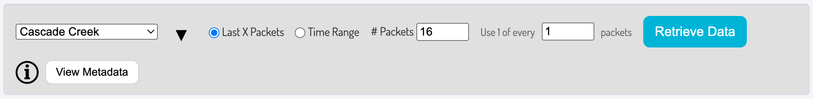
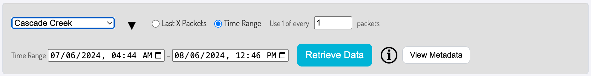
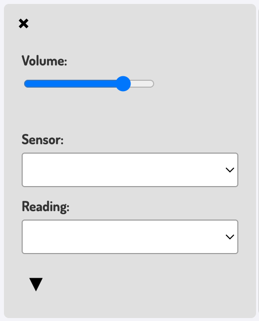
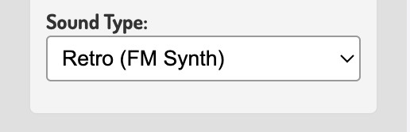
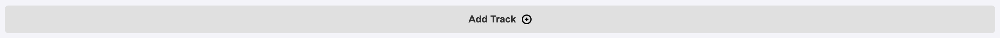
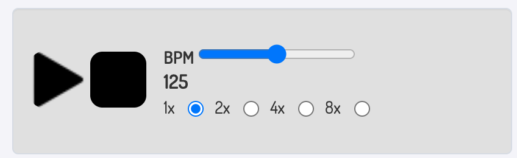

# Ear2Earth

A web-based tool that retrieves environmental sensor data from a database and sonifies it using sound synthesis. This project integrates **MongoDB**, **Node.js**, **Express**, and **Tone.js** to generate soundscapes based on real-world data.

## Website Link
https://ear2earth.com/

## Table of Contents
- [Features](#features)
- [Quick Start](#quick-start)
- [Usage Guide](#usage-guide)
- [Developer Setup](#developer-setup)
- [System Diagram](#system-diagram)
- [File Structure](#file-structure)
- [How It Works](#how-it-works)
- [Contributing](#contributing)
- [Upcoming Features](#upcoming-features)

## Features

- **Data Retrieval**: Fetch sensor data from MongoDB by packet count or time range
- **Flexible Sonification**: Choose from multiple sound synthesis modules with customizable settings
- **Musical Control**: Select scales, tonalities, starting notes, and tempo
- **Real-time Visualization**: View sensor data with interactive Plotly.js graphs
- **Dynamic Playback**: Adjust tempo on-the-fly with BPM controls and multipliers
- **Multi-module Support**: Layer multiple sound modules for complex soundscapes


## Quick Start

1. Visit [ear2earth.com](https://ear2earth.com/)
2. Select a data source from the dropdown
3. Choose how to retrieve data (Last X Packets or Time Range)
4. Configure your sound modules
5. Press Play and enjoy!

## Usage Guide
1. **Select a Data Source**:  
 
**Choose Your Data Source:**
- Select from the curated list in the dropdown
- Expand additional options using the "▼" button

**Pick Your Retrieval Method:**



- **Last X Packets**: Get the most recent X packets from your data source
- **Time Range**: Specify a custom date/time range
  - Click the calendar icon or manually type dates in Start/End boxes
  - Format: MM/DD/YYYY, HH:MM AM/PM

**Set Prescaling:**
- The prescaling value filters your data by using every Nth packet
- Example: Retrieving 16 packets with prescale of 4 → actual result is 4 packets (16 ÷ 4)

**Retrieve:**
- Click "Retrieve Data" to fetch packets from the database

2. **Sound Module Settings**:  


**Basic Settings:**
- **Volume Control**: Adjust the module's volume with the slider
- **Sensor Selection**: Choose a sensor from the dropdown
- **Reading Selection**: Pick one of the sensor's readings
- **Delete Module**: Click the X in the top-left to remove this track

**Advanced Settings:**
- Click the expand button (▼) at the bottom to access detailed options

3. **Configure Sound Settings**:  



- **Sustain Notes**: Toggle whether notes hold until the next note or use default duration
- **Tonic (Starting Note)**: Set the base note for pitch conversion (e.g., C, D, E)
- **Scale**: Choose the musical scale (Major, Minor, Pentatonic, etc.)
- **Tessitura**: Select the pitch range (Bass, Tenor, Soprano, etc.)
- **Sound Type**: Pick from FM synthesis sounds or real instrument samples


4. **Add Sound Track**:  
 
- Click the "Add Track ⊕" button below your last sound module
- Each module can be configured independently
- Layer multiple modules to create rich, complex soundscapes

5. **Playback**:  
 

**Basic Controls:**
- **Play Button** (▶): Start playback (press again to restart)
- **Stop Button** (■): Stop playback completely

**Tempo Control:**
- **BPM Slider**: Adjust Beats Per Minute (shown as a number below the slider)
- **Multiplier Buttons** (1x, 2x, 4x, 8x): Multiply the slider BPM for faster playback

**Live Adjustments:**
- All sound module settings can be changed during playback
- Changes take effect immediately

## Developer Setup

### Prerequisites
Ensure you have the following installed:
- [Node.js — Download Node.js®](https://nodejs.org/)

### Environment Setup
1. Clone this repository:
   ```sh
   git clone https://github.com/OPEnSLab-OSU/WeatherChimesWeb.git
   ```

2. Install dependencies:
   ```sh
   npm install
   ```

3. Create the .env (secrets) file

   At the root of the repository, create a file called ".env". The Node.js server will use the credentials you place in this file to connect to the MongoDB database.
   In this file, create a secret variable called URI like so:
   ```sh
   URI="mongodb+srv://<username>:<password>@<cluster-name>.<unique-cluster-variable>.mongodb.net/?retryWrites=true&w=majority"
   ```

4. Run the server:
   ```sh
   node server.js
   ```

5. Open `http://localhost:3000` in a web browser.

> ⚠️ Note: Microsoft Edge may suffer performance issues when running on battery power. Plug in or use another browser if audio playback becomes choppy/disfunctional.

## System Diagram
<br>  <br>

## File Structure
```
/weatherchimes
│── index.html      # Main frontend UI
│── style.css       # Styling for UI elements
│── index.js        # Frontend logic, Tone.js integration
│── server.js       # Express.js backend, MongoDB interactions
│── .env            # MongoDB connection string (not included in repo)
│── package.json    # Dependencies
```

## How It Works

### Data-to-Sound Pipeline

**1. Scale Construction**
   - Musical scales are built using interval patterns (e.g., Major: [2,2,1,2,2,2,1])
   - Supports classical, synthetic, and culturally specific modes

**2. Pitch Range Setup**
   - Scales span two octaves
   - Tessitura setting shifts the range (bass, tenor, soprano, etc.)

**3. Data Normalization**
   - Raw sensor data is normalized to 0.0–1.0 range
   - Ensures consistent mapping regardless of original units

**4. Pitch Mapping**
   - Normalized values select notes from the scale
   - Example: 0.75 → note at 75% position in the scale
   - Creates musically coherent transformation from data to sound

## Contributing

### Getting Started

**Backend (`server.js`):**
- MongoDB database and collection retrieval
- API endpoints: `/databases`, `/collections`, `/data`
- Express.js static file serving
- Automatic deployment via webhook on push to main

**Frontend (`index.js`):**
- Dynamic sound module creation
- Tone.js integration for audio synthesis
- UI event handling for data retrieval and playback
- [Plotly.js](https://plotly.com/javascript/) for real-time data visualization

### Recommended Learning Path

- [Node.js Tutorial](https://www.w3schools.com/nodejs/)
- [Node.js with MongoDB](https://www.w3schools.com/nodejs/nodejs_mongodb.asp)
- [Tone.js Documentation](https://tonejs.github.io/)
- OSU Course: CS 261 (Data Structures)

### Development Workflow

1. Fork the repository
2. Create a feature branch (`git checkout -b feature/your-feature`)
3. Make your changes
4. Test thoroughly (especially audio playback)
5. Commit with clear messages
6. Push and create a Pull Request

## Upcoming Features
- Modals/New User Walkthroughs
- Shared plot for two sensors (right-Y axis)
- About page
- Metadata display (coordinates, etc.)
- Sort sound modules by timestamp
- Top X-axis 
- Testing suite
- Replace PNGs with icons