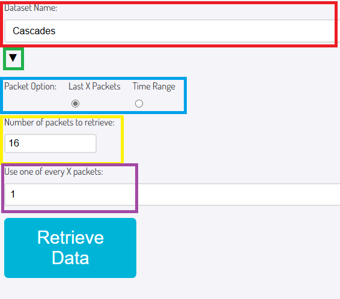
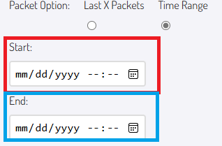
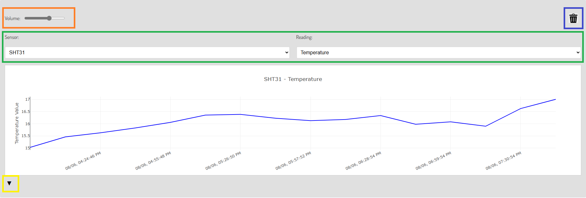
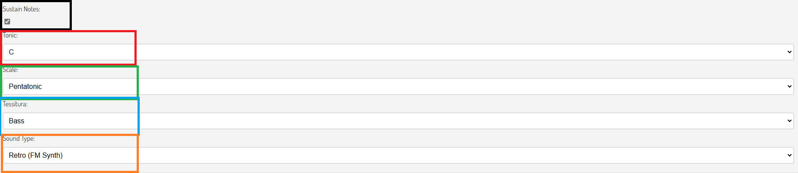
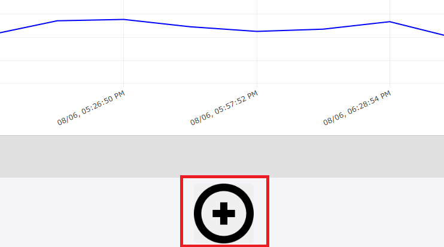
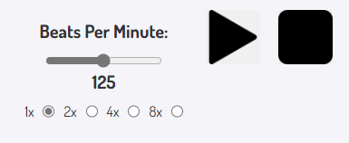
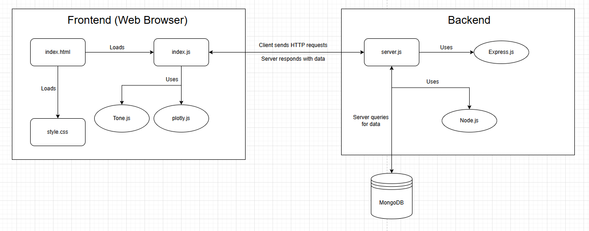

# Ear2Earth

A web-based tool that retrieves environmental sensor data from a database and sonifies it using sound synthesis. This project integrates **MongoDB**, **Node.js**, **Express**, and **Tone.js** to generate soundscapes based on real-world data.

## Website Link
https://ear2earth.com/

## Table of Contents
- [Features](#features)
- [Usage Guide](#usage-guide)
- [Developer Setup](#developer-setup)
- [System Diagram](#system-diagram)
- [File Structure](#file-structure)
- [Contributing](#contributing)
- [Data Mapping](#data-mapping)
- [Future Enhancements](#future-enhancements)

## Features
- Fetch sensor data from a **MongoDB** database.
- Choose between different sound synthesis modules.
- Select musical scales, tonalities, and tempo for sonification using **Tone.js**.
- Visualize sensor data in real-time with **Plotly.js**.
- Flexible playback options including tempo adjustment.

## Usage Guide
1. **Select a Data Source**:  
<br>  <br>
- As shown in the red box, select a data source from the curated list.
   - If you would like, expand further data source options with the "▼" in the green box
- Select either "Last X Packets" or "Time Range":
   - "Last X Packets" will retrieve the X most recent packets from your specified data source
   - "Time Range" will let you specify a time range to retrieve packets in
 
<br>  <br>
- Select the calendar symbol in the Start and End boxes to pull up a date selection menu, or use your keyboard to manually enter a date  
   -  If you select "Last X Packets", you can specify the number of packets you would like to retrieve
- Next, as in the purple box, specify the prescaling value
   - For example, if you specify 16 as the number of packets to retrieve and use one of every 4 packets, a total of 16 / 4 = 4 packets will be retrieved
- Once you've set all the values as desired, press the "Retrieve Data" button to pull packets from the database

2. **Sound Module Settings**:  
<br>  <br>
- As shown in the green box, you can specify a sensor and one of the readings from that sensor
- Labeled in orange in the screenshot, there is also a volume setting on each sound module
- If you would like to remove a sound module, there is a trash icon that can be used to delete it, labeled with the blue box at the top right
- At the bottom left of each sound module, labeled in yellow, there is a button to expand the options for altering the sound

3. **Configure Sound Settings**:  
<br>  <br>
- Black: Each note sustains until the next unique note. If unchecked, each note lasts only the default duration for that instrument
- Red: The "starting" note for the conversion from reading values to MIDI pitches
- Green: Adjust the scale to be used for conversion to MIDI
- Blue: Adjust the pitch range, or "tessitura", to be used for MIDI conversion
- Orange: Select a sound type -- Each option is either a sound produced from FM synthesis, or from a real instrument sample

4. **Add Modules**:  
<br>  <br>
- Below the bottom sound module, there is a "+" button to add more sound modules
   - Each sound module has its own options which can be uniquely adjusted

5. **Playback**:  
<br>  <br>
- Once you've got all of your sound modules configured as you like, press the Play button!
   - Note that all of the soundModule settings can still be adjusted during playback
   - When you want to restart playback, you can just press Play again
- Use the slider to adjust the speed of note playback, in the form of Beats Per Minute
- The 1x, 2x, 4x, and 8x buttons allow you to multiply the Beats Per Minute from the slider
- When you would like to stop playback, just click the large square Stop button next to the play button

## Developer Setup

### Prerequisites
Ensure you have the following installed:
- [Node.js — Download Node.js®](https://nodejs.org/)

### Environment Setup
1. Clone this repository:
   ```sh
   git clone https://github.com/OPEnSLab-OSU/WeatherChimesWeb.git
   ```

2. Install dependencies:
   ```sh
   npm install
   ```

3. Create the .env (secrets) file

   At the root of the repository, create a file called ".env". The Node.js server will use the credentials you place in this file to connect to the MongoDB database.
   In this file, create a secret variable called URI like so:
   ```sh
   URI="<MongoDB connection string goes here>"
   ```

4. Run the server:
   ```sh
   node server.js
   ```

5. Open `http://localhost:3000` in a web browser.

> ⚠️ Note: Microsoft Edge may suffer performance issues when running on battery power. Plug in or use another browser if audio playback becomes choppy.

## System Diagram
<br>  <br>

## File Structure
```
/weatherchimes
│── index.html      # Main frontend UI
│── style.css       # Styling for UI elements
│── index.js        # Frontend logic, Tone.js integration
│── server.js       # Express.js backend, MongoDB interactions
│── .env            # MongoDB connection string (not included in repo)
│── package.json    # Dependencies
```

## Contributing

### Where to Start?
If you’re new to this project, start by understanding the following:

1. **Backend (server.js)**
   - How MongoDB databases and collections are retrieved.
   - API endpoints (`/databases`, `/collections`, `/data`).
   - Express.js static file serving.
   - Pushes to main automatically trigger a **webhook** that forwards the changes to the web server and causes it to restart with the new content.

2. **Frontend (index.js)**
   - How sound modules are created dynamically.
   - Tone.js integration and how sensor data maps to pitch.
   - How UI events trigger data retrieval and playback.
   - **Plotly.js** is used to display real-time data from sensors in interactive graphs. See the [Plotly.js Graphing Library Docs](https://plotly.com/javascript/) for more.

3. **Data Flow**
   - How sensor data is normalized and mapped to MIDI pitches.
   - The relationship between sensor readings and musical scales.

### Tutorials
- You do **not** need to install MongoDB locally. Just make sure you have a connection string (e.g., from MongoDB Atlas) and include it in your `.env` file.

## Data Mapping

Sensor data is superimposed onto a two-octave pitch lattice based on the **tonic**, **scale**, and **tessitura** of your choosing. Here's how the data-to-sound conversion works conceptually:

1. **Scale Construction**:  
   A musical scale is generated by stepping through interval patterns starting from a tonic note. The intervals define how many semitones to move for each note in the scale (e.g., a Major scale follows `[2, 2, 1, 2, 2, 2, 1]` for whole and half steps). We support a large library of scales, including classical, synthetic, and culturally specific modes.

2. **Pitch Range and Tessitura**:  
   The generated scale spans **two octaves**, and its starting pitch can be adjusted using a **tessitura** setting (e.g., bass, tenor, soprano). This allows you to shift the entire playable pitch range up or down by full octaves to match the sonic texture you want.

3. **Normalization**:  
   Raw sensor data is normalized to a 0.0–1.0 range. This ensures that values from different sources or ranges can still be mapped musically in a consistent way, regardless of original units or magnitude.

4. **Data-to-Pitch Mapping**:  
   Each normalized value is then used to select a pitch from the generated scale. The value is scaled across the length of the scale array, and the corresponding MIDI note is chosen. For example, a normalized value of 0.75 would select a note three-quarters of the way up the pitch set.

This mapping process creates a musically coherent transformation from raw environmental data to sound, enabling sensor readings to be heard in tonal context. The musical output reflects both the structure of the data and the user’s musical choices.


## Future Enhancements
- Improve UI with more visual feedback.
- Expand sonification options.
